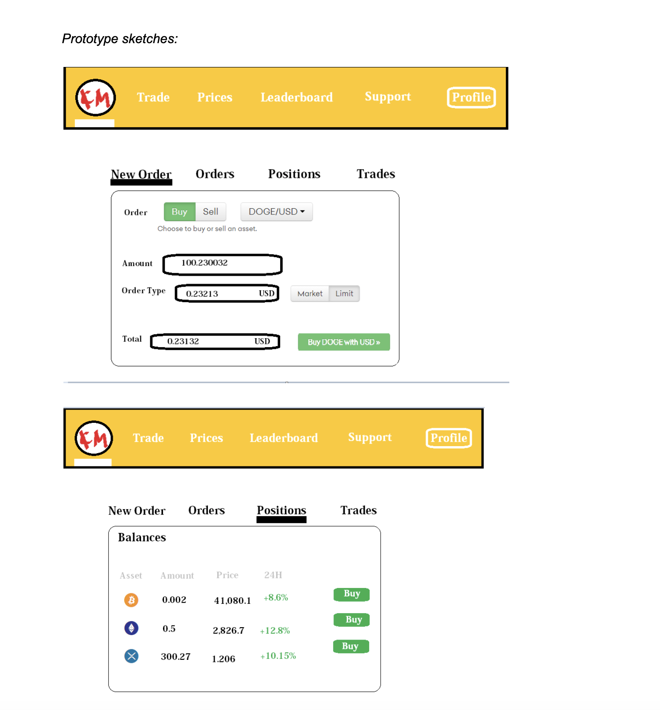

***Crypto 455 Trading Platform***

**1. High-level Description**

Our project is a Trading platform for cryptocurrencies. We envision it to be a place for experienced crypto traders, and beginners alike to discover the top cryptocurrencies in real time, and to be able to trade crypto, maintaining an investment portfolio in the hopes of becoming the latest crypto-millionaire! Thanks for checking out our project! :)

**2. Feature Goals:**

*Minimal*
- [x] View real time price of cryptocurrencies. 
- [x] View current portfolio
- [x] Discover new crypto

*Standard*
- [x] Login Authentication
- [x] Tables to get more information about top cryptocurrencies
- [x] Sign Up/ Sign In capability
- [x] Store user and portfolio information in MongoDB
- [x] Deployment to AWS
- [x] Graph Visualization in real time of cryptocurrency prices
- [x] WebSockets connection to Kraken API and Coinbase API for pulling latest crypto data
- [x] Able to trade (purchase/sell) currency

*Stretch*
- [x] SNS,SQS, Lambda serverless (additional AWS backend)
- [] Historical portfolio value
- [] Historical Graph data
- [] AWS ec2 automated deployment via github
- [] 2FA/MFA

**3. Description on how tech from Unit 1-5 are used**

[5:
Usage of tech includes best practices. Code is clean and clear. Description of usage explains in-depth how the technology has made the app better. Possibly a mention of how it compares to other similar tech. Documentation demonstrates a solid understanding of the tech learned throughout the term, and its purpose in creating a production-level full-stack web application.]

Unit 1: HTML, CSS, JS

Our application front-end and back-end is written in Typescript, (basically all our files are .tsx) which is a superset of Javascript. (essentially Javascript but with type-checking) We chose Typescript since it has compile-time type-checking, so we can be certain that any inputs are of the correct type. Also note that Typescript is a compiled language, while Javascript is an interpreted language. This greatly helps us when debugging, since we can immediately see why some functionality is not working as intended, or does not compile. 

We also wrote plenty of JSX (which is a mix of HTML and JS) in our Functional Components for React. This JSX code is used to describe what the UI will look like, typically written in the return() function of components which render the JSX code on the application. 

We mainly used Material UI to style the components on our application with a modern taste, however we also used custom CSS to arrange the layouts of the components, in particular for the portfolio page, since Material UI is a 3rd party library it was a bit too restricting for what we wanted to do.

We did not write much plain HTML since using React + Typescript + JSX leads to a much faster, maintainable, and scaleable application and codebase. Coding with HTML would lead to a lot of repetitive code and the styling would be basic, while using React + Material UI + custom CSS our lives are much easier, as we can utilize reuseable components to reduce repeating code and help modularize and reason about our design, as well as make our application have a more modern look.

So while raw HTML, CSS, JS can be used in creating basic full-stack web applications, we moreso utilized React + Typescript + JSX for it's numerous advantages listed above.

Unit 2: React

Our application front-end code is essentially written entirely in React. We have utilized React Functional Components with Hooks to manage state, to create separate, reuseable components such as a Coin component, a Coin Table component, a Charts component to visualize crypto price data in real time, a Navigation Bar component, Trade component, and more. This is one of the best features of using React, the ability to conceptualize and reason about features compartmentialized in the form of Functional Components, and the ability to re-use these components effortlessly throughout the entire application, is remarkable. 

We also took initiative to learn React Router in order to set up the navigation between pages of our Application seamlessly, and Material UI to make our components look nicer.

React serves an important purpose in creating a production-level full-stack web application, since it allows us to create a front-end that is fast, scaleable, and simple. Once some state changes, the application will automatically re-render components, and update children. It also has uni-directional data flow from parents to children, which results in stable code.

To compare with similar tech, we could have just used HTML/CSS/JS from Unit 1 for the front-end of the project. Although, it would be more challenging to style our features with a modern UI, and to write scaleable, and maintainable code this way. Very quickly we would have to copy and paste the parts of the code we want to reuse, (reuseable components) and so it would be hard to conceptually understand the codebase. So the decision to use React was a good idea!

Unit 3: Node and Express

Our application back-end code is written using Node and Express. We have utilized Node and Express in order to separate the server-side and client-side, which helps us reason about our project in these two compartments, as well as helps us test these two sides separately using tools such as POSTMAN. This is called; "Separation of Concerns", as described in the workshops slides. 

We have written HTTP requests (such as GET/POST/PUT/PATCH/DELETE) for User SignUp and LogIn, and for Portfolios and Trade (Buying and Selling) functionality, conforming to the REST API standards and CRUD. We used Express to quickly and easily set up the server side codebase.

Node and Express serves an important purpose in creating a production-level full-stack web application, since it allows us to easily and quickly separate our project into server-side and client-side code. This is ideal for a few reasons, such as: since the users do not want to know about all of the backend details they can abstract it away with this set-up as the server-side code is private, the users can't change our code, and the user's can only modify exactly what we allow them to do with the HTTP requests.

To compare with similar tech, there are some alternatives to Node and Express, such as Deno, which is actually created by the original creator of Node. Some differences between the two are that Deno does not require a package manager, (packages are linked directly via URL) while Node comes with the NPM package manager. This means no more node_modules folder if you're using Deno. Also, Deno cares a lot about security as it executes the code in a sandbox so the program by default does not have access to the file system, environment, variables, scripts, while Node does. But, Node is much older than Deno and is much more used by developers, so the support and recognizability of Node is much higher.

Unit 4: MongoDB

Our application uses MongoDB as a NoSQL database to store data such as user account information, crypto prices, user portfolios, and more. Using a separate database like MongoDB to house our data has significant advantages, since otherwise if we just stored our data locally we would not be able to scale quickly, our code would get cluttered, and it would be difficult to parse, not to mention there would more security concerns. Also, if we simply stored the data locally on every time the user visits the website, their data could potentially get lost or reset, but using MongoDB we can safely store this data externally. 

We chose to use MongoDB which is a NoSQL database (non-relational) rather than an SQL database (relational) such as MySQL, since NoSQL has more flexible data models as there is no need for a schema, also for its ability to horizontally scale on multiple servers quickly, as well as high availability and fault tolerance, which are important for a quickly growing cryptocurrency application that needs to always have it's data quickly available.

MongoDB definitely has a important purpose in creating a production-level full-stack web application, since storing large amounts of data and being able to retrieve it quickly is crucial for many such applications.

Unit 5: Release Engineering 

-perhaps talk about mono-repo, using Git, CI/CD, deployment on AWS

Our application is deployed using AWS. This is in contrast to the course suggestion to use Heroku for a few reasons, such as: we are already using various AWS services for hosting our APIs so it is quite seamless to use AWS for deployment, also that since it's on our own virtual machine there are no start-up times, while using Heroku for the assignment we noticed significant start up times. 

For our application codebase, we chose to use a mono-repo rather than a many-repo because our code-base is quite small, also some of us on the team are working full-stack so it is easier for them to access the entire code-base this way. In addition we wanted to remove the possibility of diamond dependencies (dependency hell) associated with many-repos.

We also (clearly) are using Git for Version Control since we have a relatively small project with 4 contributors, and Git is very popular so there is a lot of support on sites like StackOverflow, and detailed documentation. Version control is important since we want to be able to work collaboratively, and to be able to save old work, and not create multiple versions of a current file we are editing.

We are hosting using AWS... (@John you can talk about more AWS stuff here too)

Overall using Git and AWS for release engineering has an important purpose in creating a production-level full-stack web application, since they help address issues such as managing and building maintainable code, and making collaboration among contributers easier, which is important when scaling the application.

**4. Description of ‘Above and Beyond’ functionality **

Please give a clear description and in-depth explanation of how you went above and beyond the requirements of the course.

[9:
This project is a show-stopper and goes beyond the complexity of other projects. Would have expected this to be produced by a small start-up. We expect few or no projects to earn this rubric item in any given year. It’s here for truly exceptional work communicated effectively to the grading team.
6:
This project goes well above and beyond the requirements, including multiple points from level-3 of this rubric, or one particularly complex piece of technology.
3:
Project goes beyond the basic requirements by incorporating one to a few “extra” requirements. Some examples could be: Fully responsive, fully accessible, uses external APIs, implements a complex algorithm, utilizes ML/AI, did research for UX, supports multiple languages and/or timezones, uses location services, integrates with social media.]

-AWS (can talk about a lot of stuff here) (@John)

-WebSockets (@John)

-React Highcharts API for Charts Component (@Ryan)

-More cool backend stuff (@John)

-Trade (@Andy Ma?)

-Login Auth (@Andy Kwan)

-(external APIs, kraken? and more) (@John)

-Fully responsive, fully accessible

- (potentially: did research for UX, supports multiple languages and/or timezones, uses location services, integrates with social media.)

**5. Description of Next Steps ** 

What would you do next to further improve the app, or add additional relevant functionality? You may want to reference your in-progress or incomplete goals in this section. [2-3 sentences]

[3:
Documentation clearly describes specific, relevant goals that would continue to improve upon the functionality or usability of the app. It is clear how this would be incorporated into the existing app.]

To further improve the app, we would finish some additional features which includes: we could store each user's historical portfolio value, as well as historical crypto price data, and display and visualize it in the form of a chart, as we already have the chart component. Also, we could add features such as implementing conditional trading options, (buy/ sell crypto when some condition is satisfied) cash deposit integration for real money trading on the blockchain, as well as the ability to import your portfolio data from other trading applications to ease the transition to using our platform. (In addition, more support for accessibility would be finished, such as a Dark Mode, and the option to switch languages.)

**6. List of contributions **

Highlight areas where each team member contributed significantly. [2-3 sentences per team member]

[3:
It is very clear which team member worked on which parts of the application. The documentation describes at least one area/issue/technology where each team member took a substantial leadership role, and that team member’s contribution is reflected in the project.]

Andy Kwan:

Andy Kwan worked in both front end and back end, and took a leadership position for login authentication. Andy Kwan ensured that login authentication worked correctly by tested it in all possible cases and edge cases for correctness. Andy Kwan also worked on the Navigation Bar, and contributed to the Portfolio feature in the front end.

Ryan Liu:

Ryan primarily worked on the front-end, taking a leadership role in front end components such as Coin, the Coin Tables in the portfolio and the discover page, and the Charts component to visualize and graph the crypto price data in real-time. Ryan contributed by taking initiative to learn and utilize Material UI for the Coin Tables, React Router to set up Links between the Coins and their respective Charts pages, and Websockets API to be able to get real-time data for each crypto. Ryan also worked on the documentation.

Andy Ma:

Andy Ma worked in both front end and back end, and took a leadership position for Trading functionality. Andy Ma built the trading feature by setting up the endpoints in the backend, ensuring that the data was in the correct format, and designing the infrastructure for this feature. Andy Ma also contributed to the Portfolio feature.

John Turkson:

John took a leadership role in the back-end, working to set up all of the external API's, Websockets, AWS, MongoDB, Express, and any endpoints we needed in the front end. Contributed significantly to the project by setting up AWS for the ability to scale our application quickly and seamlessly, as well as using AWS for deploying our project in order to prevent boot-up times associated with other means of deployment such as Heroku.

***Extra information from Prototyping:***

Who is it for?

- Those interested in researching and/or trading cryptocurrencies

What will it do?

- View current crypto prices/trade crypto

What type of data will it store?

- Basic user information, current and historical crypto prices, portfolio values

What is some additional functionality you can add/remove based on time constraints?

- Most stretch goals - additional security features, trading with real crypto instead of paper money, subaccounts

**Breakdown**

View current portfolio
- Get coin prices
- Calculate individual portfolio coin values
- Sum total portfolio value
- See daily change in portfolio value

Explore new cryptocurrencies and Trade Crypto
- Browse for top cryptocurrencies in Discover Page
- Display cryptocurrency information (price,daily high, low, etc)
- Buy and sell cryptos to your portfolio

